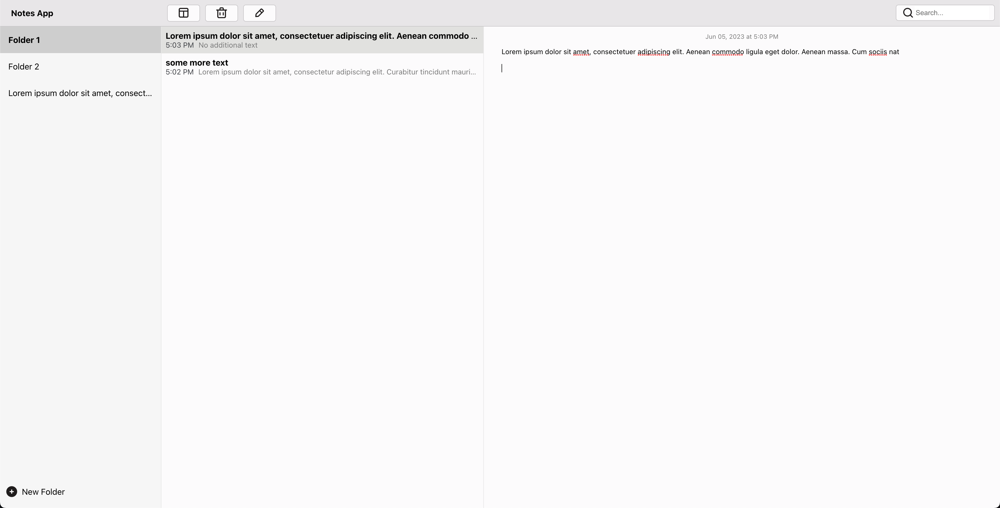
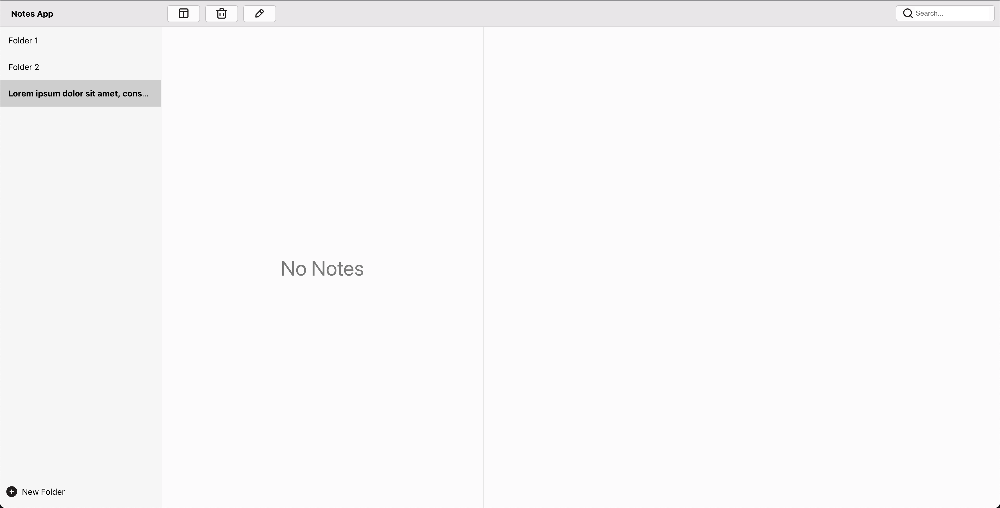
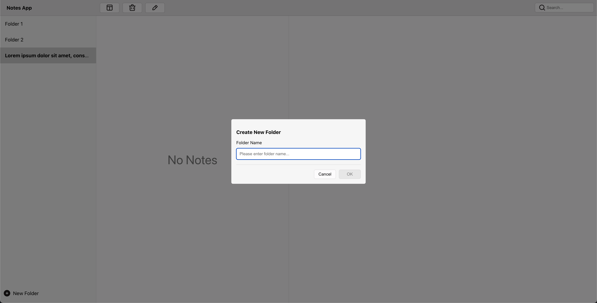
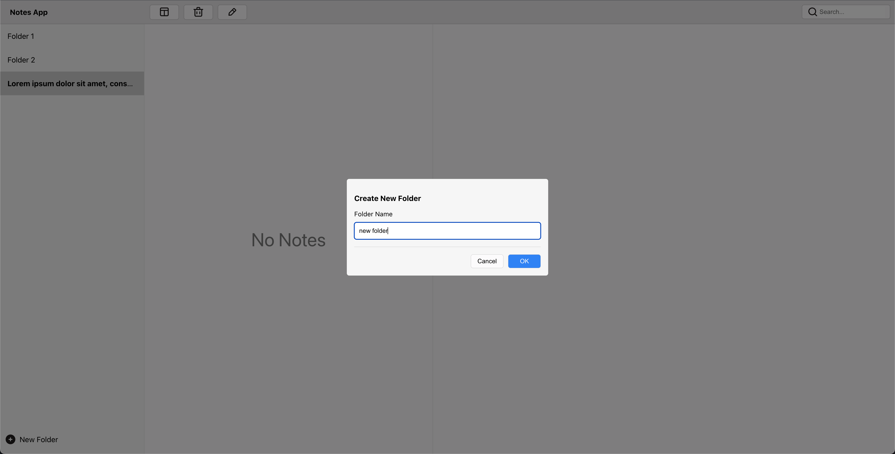
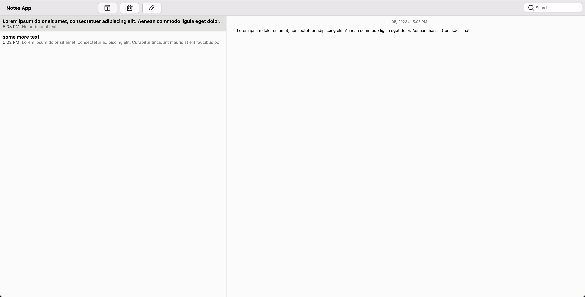
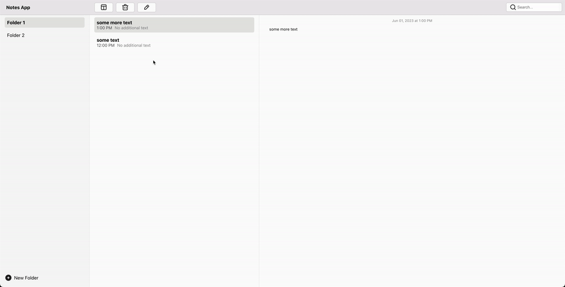

# Notes App

## Functionality
1. Folder List
- [x] Shown in the left-most sidebar (see screenshot above)
- [x] Folders listed in alphabetical order
- [x] Ability to create new folders

2. Notes List
- [x] Shown in the middle panel (see screenshot above)
- [x] Notes listed for the currently selected folder
- [x] Notes listed in order of most recently modified
- [x] Ability to create new notes in the selected folder
- [x] The first line of the note’s content is used as the title for the listing
- [x] Ability to select a note from the list and start editing it
- [x] Ability to delete currently selected note

3. Note Editor
- [x] Shown in the right-most panel (see screenshot above)
- [x] Ability to edit the note's content
- [x] Does NOT need to support WYSIWYG editing, simple text is sufficient
- [x] Should auto-save when the “Return/Enter” key is pressed on the keyboard

4. Extra Credit
- [x] Write unit tests. For the sake of time, you can just write a few tests to demonstrate this skill.
- [x] Ability to toggle (open/close) the Folder List sidebar
- [x] The second line of the note's content is used as a short text preview in the Notes List
- [ ] Display an alert or confirmation when your note has unsaved changes when you switch to a different note or folder
- [ ] Ability to search through all notes (by content) and display matching notes in the middle panel (Notes List). Clearing the search term would show all notes.

## Demo
[Loom Screen Recording](https://www.loom.com/share/69420a52cb984e8cab86b570397e3e4b)

#### Default page

#### Folder with no notes

#### Add new folder - Initial state

#### Add new folder

#### Folders Panel Toggled

#### Complete flow (with minor UI differences)

## Test
[Link to tests](./src/App.test.js)
